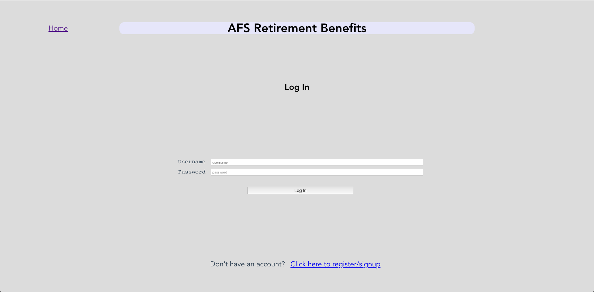

# Retirement Benefits

## Screenshot

## How to use the Heroku version
The current admin account is username: `admin`, password: `admin`.
You can sign up for your own user account on the home page.

## How to use your own version
You should create a `.env` file with the following MongoDB credentials: `DB_HOST`, `DB_USER`, and `DB_PASS`.
To create an admin account, sign up a user account with the regular workflow then edit that user in your MongoDB table to have an `SSN` value of `"admin"`. Then when you sign in with that user account it will behave as an admin account (see different pages of the site and have the ability to decide benefits for regular users).

### Enjoy!
